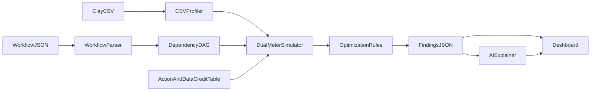

# Clay Workflow Health

Find wasted Clay credits in your table — paid enrichments before free ICP filters, bad waterfall order, wrong AI tier — and export a fixed workflow.

Clay already estimates **cost before a run**. This estimates **waste after you define the workflow**, with Actions and Data Credits tracked separately. Math is deterministic; AI only narrates.

## Quick start

```bash
npm install
npm run dev
# open http://localhost:3000
```

```bash
npm test   # Vitest hand-worked example + sample CSV fixture
npm run build
```

Sample fixtures load automatically from [`sample/companies.csv`](sample/companies.csv) (synthetic demo rows) and [`sample/workflow.json`](sample/workflow.json).

**Live demo (temporary Vercel claim — current `main`):** https://temporary-instant-magnolia-0cu7m92.vercel.app  
Claim to keep + enable auto-deploy from `main`: https://vercel.com/claim-deployment?code=99bc9911-df5d-4b5c-a741-92306d929cf5

After claiming, connect the GitHub repo in Vercel (Production Branch = `main`) so every push to `main` redeploys automatically. The old temporary URL will not update.

## Architecture



| Piece | Role |
| --- | --- |
| `lib/engine/*` | Deterministic parse → DAG → profile → dual-meter simulate → R1–R5 |
| `lib/costs.ts` | Unit costs locked from Clay Usage history + USD conversion |
| `/api/analyze` | CSV + workflow → findings JSON |
| `/api/explain` | Narrates findings only (LLM if `OPENAI_API_KEY`, else template) |

**R1** is dependency-aware: filters never move before enrichments they depend on.

## Dual meters (from your Usage history)

| Step | DC / cell | Actions / cell |
| --- | --- | --- |
| SMARTe employee count | 2.0 | 1 |
| Find contacts | 0.5 | 1 |
| Findymail work email | 0.5 | 1 |
| Validate Findymail | 0.1 | 1 |
| Filters / AI Formula | 0 | 0 |

Observed week total on the demo table: **25.7 Data Credits · 30 Actions**.

## Blank cells

Clay University export lesson: **“run condition not met” → blank in CSV**. Refunded empty lookups also appear blank. This app labels blanks as **ambiguous** and never turns blank rate into a paid-failure waste line.

## Waterfall expected cost

\[
E[\mathrm{cost}] = \sum_i \mathrm{price}_i \times P(\text{providers } 1..i-1 \text{ all missed})
\]

Hit rates come from the provider-win column when present, else declared rates in workflow JSON. **R4** reorders by hit rate per Data Credit.

## Rules

- **R1** Filter earlier (dependency-safe predicate pushdown)
- **R2** Add a run condition on paid lookup
- **R3** Drop unused enrichment
- **R4** Reorder waterfall providers
- **R5** Use AI Formula for deterministic transforms

Built by [Achsah Jojo](https://github.com/AchsahJojo) — [ClayDemo](https://github.com/AchsahJojo/ClayDemo).
