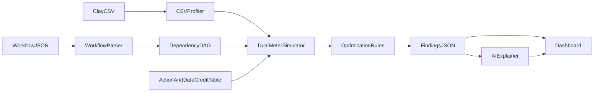

# Clay Workflow Health

Live demo for estimating **Actions** and **Data Credits** waste on a Clay table after the workflow is defined — not before a run.

Pitch: *Clay already estimates cost before a run; this product estimates waste after you define the workflow, using query-optimizer thinking (predicate pushdown) on GTM tables — and tracks Actions and Data Credits as separate meters.*

## Quick start

```bash
npm install
npm run dev
# open http://localhost:3000
```

```bash
npm test   # Vitest hand-worked example + real CSV fixture
npm run build
```

Sample fixtures load automatically from [`sample/companies.csv`](sample/companies.csv) (your Clay export) and [`sample/workflow.json`](sample/workflow.json).

## Architecture



| Piece | Role |
| --- | --- |
| `lib/engine/*` | Deterministic parse → DAG → profile → dual-meter simulate → R1–R5 |
| `lib/costs.ts` | Unit costs locked from Clay Usage history + USD conversion |
| `/api/analyze` | CSV + workflow → findings JSON |
| `/api/explain` | Narrates findings only (LLM if `OPENAI_API_KEY`, else template) |

## Dual meters (from your Usage history)

| Step | DC / cell | Actions / cell |
| --- | --- | --- |
| SMARTe employee count | 2.0 | 1 |
| Find contacts | 0.5 | 1 |
| Findymail work email | 0.5 | 1 |
| Validate Findymail | 0.1 | 1 |
| Filters / AI Formula | 0 | 0 |

Observed week total on the demo table: **25.7 Data Credits · 30 Actions**.

## Blank cells

Clay University export lesson: **“run condition not met” → blank in CSV**. Refunded empty lookups also appear blank. This app labels blanks as **ambiguous** and never turns blank rate into a paid-failure waste line.

## Waterfall expected cost

\[
E[\mathrm{cost}] = \sum_i \mathrm{price}_i \times P(\text{providers } 1..i-1 \text{ all missed})
\]

Hit rates come from the provider-win column when present, else declared rates in workflow JSON. **R4** reorders by hit rate per Data Credit.

## Rules

- **R1** Filter / ICP too late (predicate pushdown)
- **R2** Missing run condition on paid lookup
- **R3** Unused enrichment
- **R4** Waterfall provider reorder
- **R5** Wrong AI tier (`use_ai` / `claygent` → free `ai_formula`)

## Demo script

See [`DEMO_SCRIPT.md`](DEMO_SCRIPT.md).
